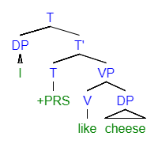

I decided to write a blog post about the English construction *ain't got no*, which is semantically equivalent to standard English *don't have any*. Nothing I will say is particularly novel, but rather represents an application of some basic linguistic analysis to this particular phrase. Interestingly, this high-frequency phrase neatly touches on a variety of interesting linguistic concepts. Further, this discussion is a case study in *linguistic descriptivism*, which is central to the scientific study of language. Rather than *prescribing* whether a sentence is grammatically right or wrong according to a socially relative standard, descriptivism takes the perspective that a variety of grammars exist across different speakers. The goal of linguistics, then, is not to posit which grammar is "right", but to describe what grammar would produce the utterances that are observed. If there is linguistic variation, then the natural question is what variation in a system of *grammar* can explain the observed variation in a collection of speech. From this perspective, comparing two slightly different dialects is a lot like conducting a physics experiment with slight variations of the same physical system. It provides an opportunity to build and test theories about the cognitive system underlying language, and how tweaking different *parameters* of this system can lead to different linguistic properties. In our case, we will find that *ain't got no* touches on a variety of interesting phenomena in linguistic theory: namely, *do*-support, reanalysis, temporal semantics, and negative polarity items. For speakers of English, this represents an interesting opportunity to systematically understand the connection between two dialectal alternatives. Stepping out of the ivory tower a bit, it might also challenge the intuition that some native speakers have that a standard variety is somehow more "correct" than a nonstandard one. Rather, the two varieties just represent two different parameterizations of the innate human capacity for language.

## Distribution of *ain't got no*

The construction *ain't got no* is a nonstandard English alternative to standard *don't have any*. In America, it is often associated with African American English, although it can also be found in other dialects, including Appalachian English and even some British English varieties. Further (making an assertion as a native speaker) I believe it is understood and produced quite broadly across American English, outside of any specific dialect. As is often the case with dialect mixing, use of *ain't got no* may carry social connotations separating its usage from standard *don't have any*.

TALK ABOUT EXAMPLES, FREQUENCY
As can be seen (here)[https://trends.google.com/trends/explore?date=all&geo=US&q=ain%27t%20got%20no,don%27t%20have%20any], *ain't got no* is actually a more frequent Google search term than *don't have any*. With the caveat that search data is probably not a fully faithful representation of linguistic usage, this suggests that *ain't got no* occurs with fairly high frequency in vernacular English.

Despite this frequency, *ain't got no* is probably best not analyzed as a cohesive idiomatic unit; rather, it is a common phrase in which several nonstandard linguistic features co-occur. The fact that these features often appear together can probably be attributed to the fact that possession, the semantic relation denoted by *ain't got no*, is common and salient in daily speech. We will divide our linguistic analysis of *ain't got no* to focus on the words *ain't*, *got*, and *no* separately.

## *ain't*

https://en.wikipedia.org/wiki/Ain%27t
This part needs some serious rewriting. "ain't + perfective vs aint do

Let's contrast *ain't* with standard English *don't*. In standard English, *don't*, abbreviating *do not*, exemplifies a phenomenon called *do*-support. In standard English negation, sentences are negated by inserting *do* before the negator *not*:

1. I like cheese.
2. I do not like cheese.
3. \* I not like cheese.

The important fact is that (2) is acceptable to speakers, whereas (3) is not, which is indicated by an \*. This is quite different from negation in many other languages, which can be expressed simply by a single word. Compare English with Icelandic in (4) and Latin in (5), where inserting a single word negates the truth conditions for the full sentence:

4. Mér likar **ekki** ost. (I don't like cheese)
5. Caseum **non** amo. (I don't like cheese)

It turns out that the presence of *do*-support in English arises from a more fundamental difference between English and these other languages. Without going too far into the theoretical details, syntactic theory posits that sentences have a latent hierarchical structure which is flattened to produce a sequence of words. Different linguistic concepts (for example, words) appear in different positions within this structure. One such position is Verb (V), where *like* would appear in (1). Another such position is Tense (T), which would be populated by an unpronounced element representing present or past. As can be seen in the syntactic structure of *I like cheese*, T occurs directly to the left of V in the tree:

It is theorized that a universal constraint across all languages is that some element must surface in T (This is a controversial claim for some tenseless languages like Chinese). In many languages, including English, the verb in V "moves" leftwards to T, acquiring either present or past tense. This movement satisfies the constraint that T must be occupied. This also explains why, in unnegated sentences, a different form of the verb surfaces depending on the tense of the sentence. However, specifically in English, the negator *not* blocks this V-to-T movement. To satisfy the constraint that T must be filled, English "hallucinates" an *expletive*, a word with no semantic content, within T. In standard English, this expletive is *do*, but there's no general reason why this must be the case. One theoretically coherent way to explain nonstandard *ain't* is that the expletive is instead some word *ai*, which is perhaps a phonologically reduced form of *am* or *are*. Thus, *ain't* can be analyzed analogously to *don't*, where the form of the expletive *do* has been replaced by a different string.

## *got*

In standard English, *got* is the past tense of the verb *get*. In the dialectal construction *ain't got no*, however, *got* must be uninflected for tense based on its syntactic position, and *ain't* indicates that the tense of the clause is present. This suggests that *got* is actually the reanalysis of the past-tense form as a new present-tense verb with semantics similar to standard *have*. Let's explore this further.

Standard English *get*, at least in its basic sense, can be taken to represent a binary acquisition event. In other words, *get* specifies a point in time when an agent $x$ comes into the possession of an object $y$. Mathematically, we can write this as

$$ [[ x \; \textit{get} \; y ]] = \mathrm{acquires}(x, y) . $$

Semantically, tenses serve to ground events in time. Specifically, the past tense indicates that an event happened at a reference time ($r$) before time of speech ($t$). We will use the operator $@$ to represent events grounded in time; for example, $e @ t$ represents the condition that the event $e$ "occurred at time" $t$. Using this notation, we write the truth conditions for the past tense of a verbal event $e$ as:

$$ \exists r \; \mathrm{s.t.} \; r < t \wedge e(x, y) @ r . $$

Applying this to *get*, we derive that the past tense *got* has truth conditions:

$$ \exists r \; \mathrm{s.t.} \; r < t \wedge \mathrm{acquires}(x, y) @ r . $$

Intuitively, this says that the agent $x$ has acquired the object $y$ at some point prior to the present. In contrast, standard *have* is a stative verb. It does not indicate acquisition; rather, it denotes a point in time when agent $x$ is *in possession* of object $y$. In other words,

$$ [[ x \; \textit{gets} \; y ]] = \mathrm{possesses}(x, y) . $$

In this definition, we leave $\mathrm{acquires}$ and $\mathrm{possesses}$ as atomic events. But is there any interesting "common-sense" structure relating their semantics? Intuitively, an acquisition event represents the start of a state of possession. We might then assume the following world knowledge in our semantic model, which says that $x$ possesses $y$ iff $x$ has previously acquired $y$ (This simple account does take into account the fact that $y$ could be "lost" after it is acquired):

$$ \mathrm{possesses}(x, y) @ t \iff \; \mathrm{s.t.} \; r < t \wedge \mathrm{acquires}(x, y) @ r . $$

It might strike you that the right-hand side expression for present-tense *have* is exactly equivalent to the semantics of the standard English past-tense *got*. Thus, it is not a huge jump to reanalyze *got* as a new verb in the present tense. Its semantics remain the same (if you accept the stated assumption); the only change is how tense markers get expressed. This formal semantic analysis helps explain the diachronic origin of *got* as a verb with similar semantics to *have*.

## *no*

In standard English, *no* is a generalized quantifier with a "negative" meaning. In a sentence like *No dogs speak*, *no* takes a class of entities (*dogs*) and a predicate (*speak*), and asserts that the predicate does hold for any entity within the class. The semantics of *no* in this dialect appear to be different than this standard English *no*, however.

To analyze *no*, we will first attempt to document the usage of the standard determiner *any*, which in linguistics is called a *negative polarity item*. What this means is that it can occur only in contexts defined as "negative". In the positive variant of these contexts, the alternate determiner *some* must appear instead. Defining exactly what constitutes is a negative context is complicated. Side-stepping this issue, consider the following examples illustrating the alternation between *any* and *some*:

6. I have some money.
7. \* I have any money.
8. \* I don't have some money.
9. I don't have any money.

The context in (6) and (7) has positive polarity, since there is no negation. Therefore, only *some* is allowed to occur. In (8) and (9), the negation makes the context have negative polarity. This means *any* is the only allowed option there.

What then, is going on with *ain't got no*? A first-pass analysis might posit that this constitutes *double negation*: with *ain't* introducing a negator, and standard *no* also contributing some kind of negative semantics similar to its meaning as a generalized quantifier. In light of our discussion of negative polarity, however, this is perhaps not the most precise analysis we can give. Rather, based on the structure of the utterance, it is simpler to say that the string *no* is being used as the negative polarity counterpart to *some*, rather than standard English *any*. This constitutes a reanalysis: in addition to its standard use as a generalized quantifier, *no* has received a separate, additional license as a negative polarity item. A priori, the contrastive distribution of *some*/*no* is no less arbitrary then the contrastive distribution between *some*/*any* in standard English.

It's interesting to note that there is a link between negative quantifiers and negative polarity items in many languages. For example, Spanish has:

10. Quiero algo. (I want something)
11. No quiero nada. (I don't want anything)

Where *nada* is both the negative polarity counterpart of *algo* (something) and the word for "nothing". Due to the subtle differences between negative polarity items and negative quantifiers, this is not particularly surprising. One can imagine that this correspondence often historically through reanalyses analogous to the emergence of the *no* NPI in nonstandard English.