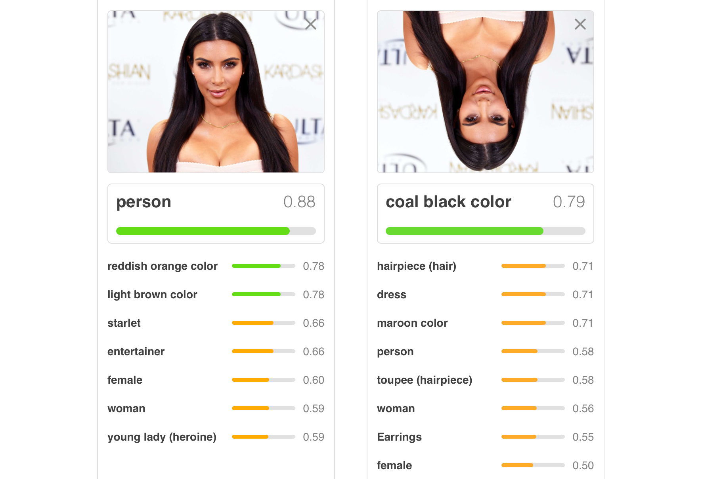
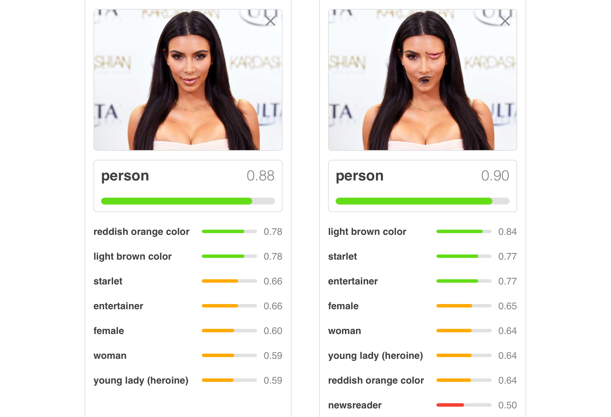

Capsule networks are a sophisticated neural network architecture originally proposed in the domain of computer vision. Motivated by some of the main problems with convolutional neural networks for image classification, capsule layers allow low-level features about an image to be effectively combined into higher-level information. In linguistic terms, we might call this compositionality. Given the fact that compositionality exists in natural language, we might wonder whether this kind of architecture could be useful for NLP tasks. Three recent papers have shown that capsule networks do in fact perform well on text classification tasks. One of the other big takeaways from these papers is that the capsule representation allows for effective transfer learning.

## Capsule Network Architecture

*For a more extensive discussion motivating the capsule architecture, see [this blog post](https://medium.freecodecamp.org/understanding-capsule-networks-ais-alluring-new-architecture-bdb228173ddc).*

### Convolutional Networks

To understand how capsule networks are designed, we should first consider standard convolutional networks. Convolutional networks are essentially a cascade of convolutional layers and max-pooling layers. Convolutional layers slide a filter across an image to look for different patterns, and pooling layers consolidate information from the previous layer into a more condensed form.

While this convolutional architecture has achieved tremendous success on image classification and other tasks, it suffers from some severe limitations. For one, it takes a tremendous amount of data to learn rotational and reflectional invariants of high-level features (for example, faces). This is because we essentially need to learn a filter corresponding to each possible rotation of a feature. Another problem is that max-pooling loses information about the relative position of objects. For example, imagine we have a face where the positions of the eye and mouth are swapped. If max-pooling collapses the facial region down to one pixel, then, to the next layer of the network, it will be impossible to distinguish this distorted face from a normal one. Thus, we can create a variety of wacky faces that will fool convolutional networks but not humans. To solve this problem, we would want some model that enforces relative agreement between features.

| **Problems with Transformations** | **Craziness with Max-Pooling** |
|--------------------------------------|-------------------------------|
|  |  |

### Capsules

Enter capsule networks! The main idea behind a capsule network is that we replace each scalar-valued filter in a convolutional network with a vector-valued *capsule*. We can think of the value of a filter in a convolutional network as a boolean which tells as whether or not a feature exists there. On the other hand, because a capsule is a vector, it can encode not just this probability, but also properties (called *instantiation parameters*) of the feature. More specifically, for a capsule $u$:

* The **magnitude** of $u$ (between 0 and 1) gives a probability for the existence of the capsule feature.
* The **direction** of $u$ (in a high dimensional space) encodes different parameters of the capsule.

### Connecting Capsule Layers

Connecting layers of a capsules is a little more complicated than matrix multiplication in a conventional neural network. The existence of instantiation parameters allows us construct layer connection that enforce a learned notion of agreement. This is done in a two-step process:

1. Compute *vote vectors* between each capsule $i$ in the previous layer and each capsule $j$ in the following layer. Intuitively, these vote vectors encode what information should be passed from $i$ to $j$.
2. Run an iterative algorithm called *dynamic routing* to calculate the next layer's capsules from the vote vectors. This algorithm is meant to enforce agreement, and uses no parameters.

An important fact to highlight is that, just like in a standard neural network, we can get different kinds of layers by applying routing in different ways. For example, we can get a convolutional capsule layer if we route from a sliding window in the previous layer, or a feedforward capsule layer if we route from all the capsules in the previous layer. Another important type of capsule layer is a primary capsule layer, which converts normal neural network values into capsules. This is always applied at the beginning of a capsule network.

There are a lot more details here. You can check out my [slides](slides.pdf) or [writeup](writeup.pdf) from Dragomir Radev's advanced NLP seminar, as well as the other resources which are linked there.

## Capsules Networks for NLP

I will discuss three papers from 2018 that apply capsule networks to NLP tasks. I expect there will be more work published soon on this exciting and cutting edge area of research.

### [Investigating Capsule Networks with Dynamic Routing for Text Classification](https://arxiv.org/abs/1804.00538)

This paper was the first work to apply capsule networks to a text classification task. They evaluate the performance of a capsule network classification model on a variety of single-class and multi-class classification tasks. The multi-class data sets have single-class training data and multi-class evaluation data, so to perform well, the model must learn to transfer knowledge effectively from the single-class to multi-class case.

A major contribution of the paper is to develop a capsule network architecture for text classification. This architecture, which is largely adapted by the other papers, can be summarized as follows:

1. Standard convolutional layer
2. Primary capsule layer
3. Convolutional capsule layer
4. (Flatten capsule matrix into capsule vector)
5. Feedforward capsule layer

The results section compares the performance of this capsule architecture to many different strong baseline methods. In single-class classification, the standard capsule network architecture performs comparably to the best baseline methods. The authors also try a three-headed variant of their capsule network where three network computations are performed in parallel and then averaged, and this performs marginally better than the baselines. In the multi-class case, both capsule methods outperform the baselines, with the greatest increases again reported for the three-headed network. This suggests that the capsule representation is very effective at transferring knowledge from the single-class to multi-class problem.

### [Identifying Aggression and Toxicity in Comments using Capsule Network](http://www.aclweb.org/anthology/W18-4412)

This paper focuses on a specific application of text classification: namely, classifying toxic comments. They look at two data sets for this task: one of comments in English, and the other which mixes English and Hindi. They hypothesize that the capsule architecture will be particular helpful in the code-mixed case because the local representations built up by a capsule network should handle mixing better than recurrent sequence models like LSTMs.

The authors approach this task using an architecture similar to the one used by Zhao, et al. They make two modifications to the architecture. First, they use an LSTM for the initial feature extraction layer instead of a convolutional network. Second, they replace the final feed-forward capsule layer with a standard feed-forward layer. The reason for this is so that they can use a focal loss function, with which they hope to overcome the class imbalance problems inherent to toxic comment classification.

Again, the authors compare their capsule architecture to a variety of competitive baseline methods. On both data sets, the capsule architecture outperforms the baseline methods. On the English data set, they achieve 98.46% accuracy, which is roughly 0.2% greater than the next best method. On different versions of the code-mixed data set, they report accuracies of 63.43% and 59.41%, which in both cases constitutes an increase of roughly 1% over the next-best method. These results imply that the capsule architecture is especially effective at classifying toxic comments when they are code-mixed.

### [Zero-shot User Intent Detection via Capsule Neural Networks](https://arxiv.org/abs/1809.00385)

This paper applies a similar capsule method to the classification task of zero-shot intent detection. Standard intent detection is the task where a dialog system must classify the an actionable intent that a user's query represents from a known set of intents. For example, "Play a song!" might be classified as `play_music`. The zero-shot problem is more complicated: in this case, we have access to a set of known intents during training, but, at inference time, our goal is to classify from a set of previously unencountered intents. For example, imagine that we already trained a model on data containing the `play_music` intent, but our model has never seen `play_movie`. The goal is that we can still map "Play a movie!" to `play_movie`. Doing this requires the model to generalize what it has learned about the known intents to the unknown ones.

To do this, the authors devise an architecture that consists of three modules: two which are present during training and whose output capsules are a prediction over known classes, and a third one which attempts to generalize from these intermediate output capsules to unknown intents. The first two modules together function similarly to the base model developed by Zhao et al., except that the feature extraction layer is an LSTM with self-attention. These two modules are trained to classify known intents. The major architectural difference is the third untrained module for zero-shot inference. First, the authors compute a similarity matrix between known intents and unknown intents by using word embeddings for the words in the intent names. Then, they compute new vote vectors for the zero-shot layer by taking a weighted average of the vote vectors from the layer classifying known intents. They then use standard dynamic routing to convert these vote vectors into a layer of classification capsules for the unknown intents. Overall, I find this to be a really clever way to exploit the lack of parameters in dynamic routing for zero-shot learning.

The experimental results show that the known intent detection module by itself outperforms baselines for known intent detection across two different data sets. However, the key result is that the zero-shot intent detection network significantly outperforms the previous baseline systems against which it is compared. Thus, the authors are able to effectively utilize the capsule network architecture to do zero-shot inference.

### Takeaways

Viewed together, these papers develop a standard capsule network architecture that can be used for text classification tasks. Each paper shows how a capsule network performs comparably to or better than the previous state of the art on a text classification task. Additionally, the papers leverage the representational power of capsules for effective transfer learning. The potential for transfer learning might be one of the most attractive things about the capsule network architecture for NLP tasks. Another exciting direction for future work is the adaptation of capsule networks to NLP tasks besides text classification.